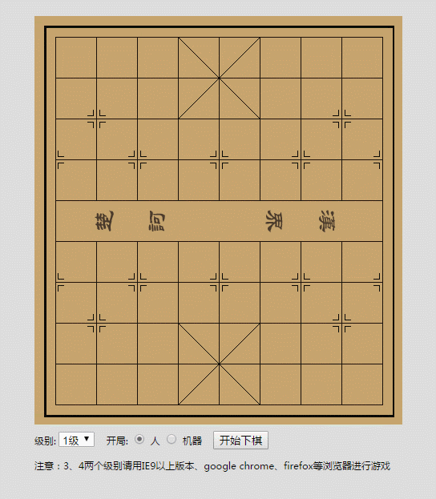

## js写的象棋游戏


html code:
```
<!Doctype html>
<html lang="en">
<head>
    <meta charset="UTF-8">
    <title>Document</title>
    <link rel="stylesheet" href="css/style.css"/>
</head>
<body>
<div class='board' id='board'>
</div>
<div class="op">
    级别:
    <select id="level">
        <option value="1">1级</option>
        <option value="2">2级</option>
        <option value="3">3级</option>
        <option value="4">4级</option>
    </select>
    &nbsp;&nbsp;
    开局:
    <input type="radio" name="start" value="1" id="start_1" checked="">
    <label for="start_1">人</label>
    <input type="radio" name="start" value="0" id="start_2">
    <label for="start_2">机器</label>
    &nbsp;&nbsp;
    <input type="button" class="ipt" value="开始下棋" id="btn"/>
    <p>
        注意：3、4两个级别请用IE9以上版本、google chrome、firefox等浏览器进行游戏
    </p>
</div>
</body>
</html>
<script src="js/base.js"></script>
<script src="js/moveGenerator.js"></script>
<script src="js/evaluation.js"></script>
<script src="js/searchEngine.js"></script>
<script src="js/UI.js"></script>
<script>
    var cc = new ChineseChessUI( 'board' );
    function start() {
        var levelEls = document.getElementById( 'level' );
        var startEls = document.getElementsByName( 'start' );
        var level;
        var start;
        for (var i = 0; i < 2; i++) {
            if( startEls[ i ].checked ) start = startEls[ i ].value;
        };
        level = levelEls.value;
        cc.start( level, start );
    }
    document.getElementById( 'btn' ).onclick = start;
</script>
```
